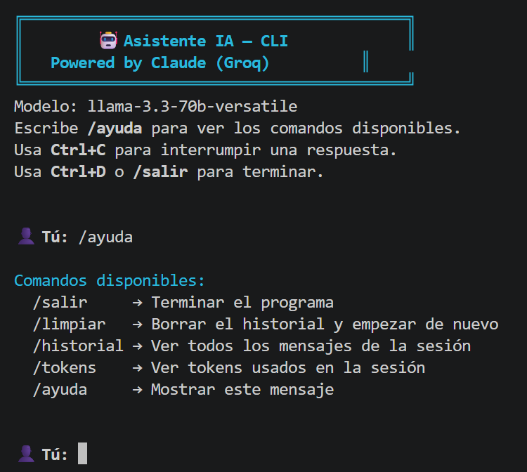
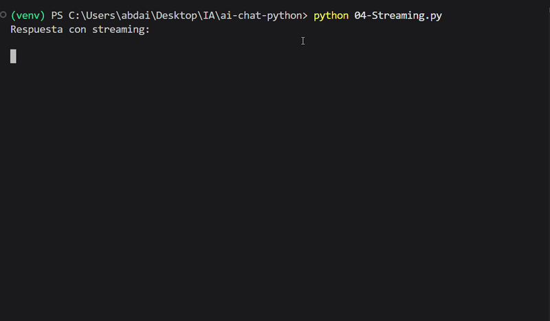
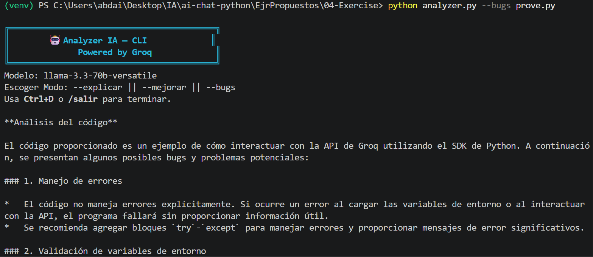

# 🤖 AI Chat Python — CLI Assistant with Groq

<div align="center">


A modern command-line AI assistant built with Python and the Groq API.

Learn how to work with LLM APIs, streaming, memory, prompts, error handling, and AI-powered developer tools.

</div>

---

# 📸 Preview

## Main Assistant



## Streaming Responses



## Python Code Analyzer



---

# ✨ Features

- ⚡ Real-time streaming responses
- 🧠 Conversation memory & history management
- 💾 Save and restore chat sessions
- 🔄 Automatic retries with exponential backoff
- 🎯 Configurable system prompts
- 📊 Token usage tracking
- 🌡️ Temperature & max token controls
- 🛠️ Specialized AI tools:
  - Translator
  - Python test generator
  - Python code analyzer
- 🎨 Beautiful colored CLI interface
- 📁 Batch file processing
- 🐍 Built entirely with Python

---

# 📚 What You'll Learn

This project teaches practical concepts used in modern AI applications:

- LLM API integration
- Prompt engineering
- Streaming responses
- CLI application design
- Error handling patterns
- Token accounting
- AI conversation memory
- Batch processing
- Developer tooling with AI
- Modular Python architecture

---

# 🛠️ Tech Stack

- Python 3.10+
- Groq API
- python-dotenv

---

# 📦 Installation

## 1. Clone the repository

```bash
git clone https://github.com/abdair-coca/CLI_PYTHON_AI

cd ai-chat-python
```

---

## 2. Create a virtual environment

### Windows

```bash
python -m venv venv
.\venv\Scripts\activate
```

### Linux / macOS

```bash
python3 -m venv venv
source venv/bin/activate
```

---

## 3. Install dependencies

```bash
pip install groq python-dotenv
```

---

# ⚙️ Configuration

Create a `.env` file in the project root:

```env
API_KEY=your_groq_api_key
MODEL=llama-3.3-70b-versatile
```

---

# 🔑 Getting a Groq API Key

1. Go to [Groq Console](https://console.groq.com/?utm_source=chatgpt.com)
2. Sign in or create an account
3. Open the API Keys section
4. Generate a new API key
5. Paste it into your `.env` file

---

# 📁 Project Structure

```text
ai-chat-python/
│
├── asistente.py
├── groqp.py
│
├── 01-PrimeraLlamada.py
├── 02-Parametros.py
├── 03-Conversacion.py
├── 04-Streaming.py
├── 05-Errores.py
│
├── .env
├── .gitignore
├── README.md
│
├── images/
│   ├── assistant-demo.png
│   ├── streaming-demo.gif
│   └── analyzer-demo.png
│
└── EjrPropuestos/
    │
    ├── 01-Exercise/
    │   └── traductor.py
    │
    ├── 03-Exercise/
    │   └── assistent.py
    │
    └── 04-Exercise/
        └── analyzer.py
```

---

# 🚀 Usage

# 🤖 Main Assistant

Run the interactive CLI assistant:

```bash
python asistente.py
```

---

## Available Commands

| Command | Description |
|---|---|
| `/salir` | Exit the program |
| `/limpiar` | Clear conversation history |
| `/historial` | Show chat history |
| `/tokens` | Display token usage |
| `/ayuda` | Show help menu |

---

# 📖 Tutorials

The numbered files are step-by-step learning exercises.

## First API Call

```bash
python 01-PrimeraLlamada.py
```

## Parameters & Streaming

```bash
python 02-Parametros.py
```

## Conversation Memory

```bash
python 03-Conversacion.py
```

## Real-time Streaming

```bash
python 04-Streaming.py
```

## Error Handling

```bash
python 05-Errores.py
```

---

# 🧪 Exercises

# 🌍 Translator

```bash
python EjrPropuestos/01-Exercise/traductor.py
```

Features:
- Multi-language translation
- Batch translation from files
- Token comparison

---

# 🧠 Assistant with Persistent Memory

```bash
python EjrPropuestos/03-Exercise/assistent.py
```

Additional commands:
- `/guardar`
- `/resumir`

---

# 🔍 Python Code Analyzer

Analyze Python files with AI:

## Explain code

```bash
python analyzer.py --explicar app.py
```

## Improve code

```bash
python analyzer.py --mejorar app.py
```

## Find bugs

```bash
python analyzer.py --bugs app.py
```

---

# 🌊 Streaming Example

```python
for chunk in stream:
    content = chunk.choices[0].delta.content or ""
    print(content, end="", flush=True)
```

---

# 🧱 Concepts Covered

- Prompt engineering
- Streaming APIs
- System prompts
- Chat memory
- Token tracking
- Error recovery
- Retry systems
- Batch processing
- CLI architecture
- Python best practices

---

# ⚠️ Important Notes

- Never share your `.env` file
- Never expose your API key
- Monitor token usage carefully
- Groq APIs have rate limits
- This project is focused on learning and experimentation

---

# 📚 Resources

- [Groq API Documentation](https://console.groq.com/docs?utm_source=chatgpt.com)
- [Groq Python SDK](https://github.com/groq/groq-python?utm_source=chatgpt.com)
- [Available Models](https://console.groq.com/docs/models?utm_source=chatgpt.com)

---

# 🔮 Future Improvements

- Web interface with FastAPI
- GUI desktop version
- Voice assistant support
- Multi-file code analysis
- Git integration
- AI-powered commit messages
- RAG support
- Local vector database
- Docker support

---

# 📄 License

This project is open-source and available under the MIT License.

---

# 👨‍💻 Author

Built by Abdair as a hands-on AI engineering learning project.

If you like the project, consider giving it a ⭐ on GitHub.
